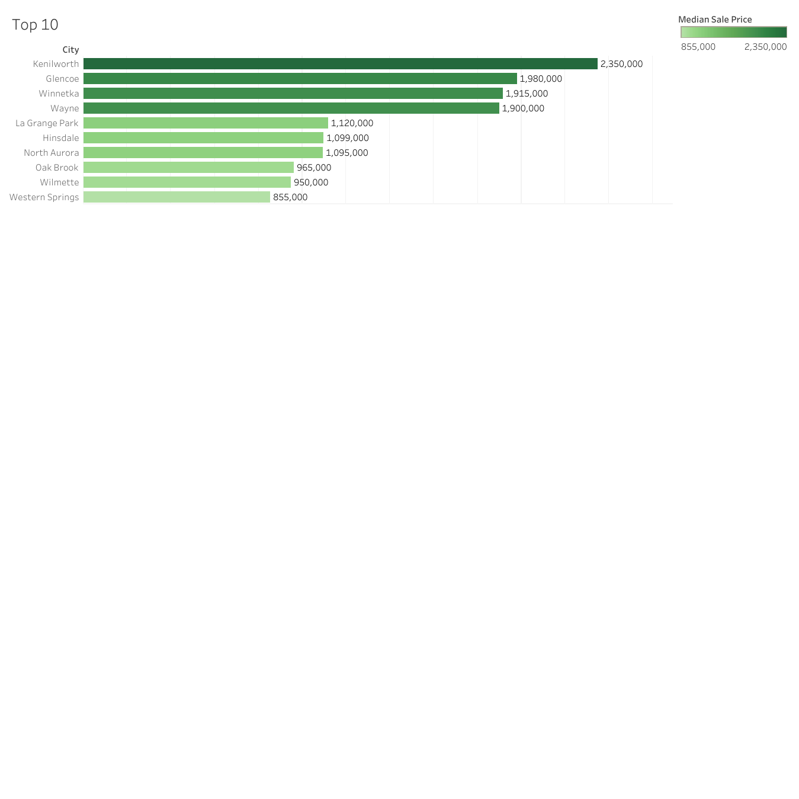
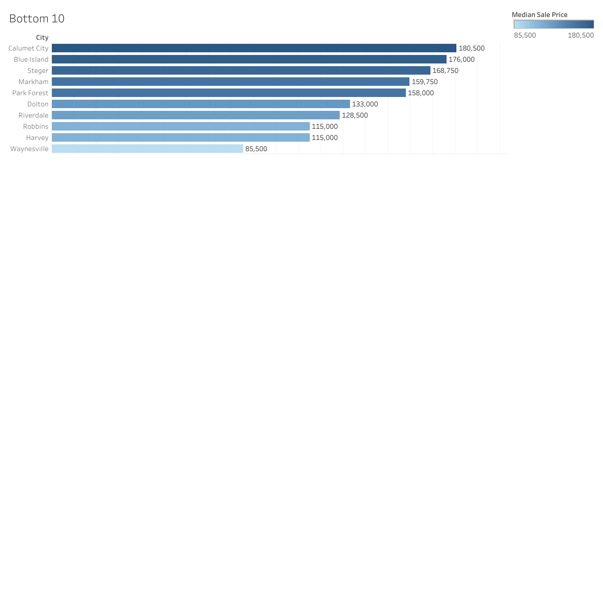

## westsub
Data about Western Suburbs of Chicago, Illinois

## 📂 Project Structure
* [SQL Scripts](./sql/) - Contains the BigQuery queries
* [Excel](./excel/) - Filtered CSVs of the 2026 Western Suburbs market.
* Visualization - Tableau Web Editor

## 🎯 Key Insights & Visualization
By filtering the dataset down to the Top 10 and Bottom 10 markets, this analysis highlights the stark pricing disparities across the Western Suburban Illinois regional housing landscape.

<!-- EMBED YOUR IMAGE HERE -->

## 🛠️ Technical Challenges and Solutions
* Fuzzy Joining: Resolved a "Zero Result" join issue caused by suffix mismatches (e.g., "Cook" vs "Cook County, IL") by utilizing LIKE operators and string CONCAT wildcards to ensure 100% data retrieval.
* Uploaded Directly from Google Drive instead of Excel 

## Source: https://www.redfin.com/news/data-center
